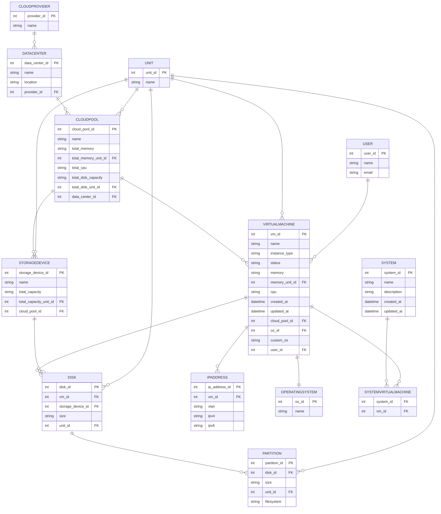

# ER 図

```mermaid
erDiagram
    CLOUDPROVIDER {
        int provider_id PK
        string name
    }
    DATACENTER {
        int data_center_id PK
        string name
        string location
        int provider_id FK
    }
    CLOUDPOOL {
        int cloud_pool_id PK
        string name
        string total_memory
        int total_memory_unit_id FK
        string total_cpu
        string total_disk_capacity
        int total_disk_unit_id FK
        int data_center_id FK
    }
    VIRTUALMACHINE {
        int vm_id PK
        string name
        string instance_type
        string status
        string memory
        int memory_unit_id FK
        string cpu
        datetime created_at
        datetime updated_at
        int cloud_pool_id FK
        int os_id FK
        string custom_os
        int user_id FK
    }
    STORAGEDEVICE {
        int storage_device_id PK
        string name
        string total_capacity
        int total_capacity_unit_id FK
        int cloud_pool_id FK
    }
    DISK {
        int disk_id PK
        int vm_id FK
        int storage_device_id FK
        string size
        int unit_id FK
    }
    PARTITION {
        int partition_id PK
        int disk_id FK
        string size
        int unit_id FK
        string filesystem
    }
    IPADDRESS {
        int ip_address_id PK
        int vm_id FK
        string vlan
        string ipv4
        string ipv6
    }
    OPERATINGSYSTEM {
        int os_id PK
        string name
    }
    UNIT {
        int unit_id PK
        string name
    }
    SYSTEM {
        int system_id PK
        string name
        string description
        datetime created_at
        datetime updated_at
    }
    SYSTEMVIRTUALMACHINE {
        int system_id FK
        int vm_id FK
    }
    USER {
        int user_id PK
        string name
        string email
    }

    CLOUDPROVIDER ||--o{ DATACENTER: ""
    DATACENTER ||--o{ CLOUDPOOL: ""
    CLOUDPOOL ||--o{ VIRTUALMACHINE: ""
    CLOUDPOOL ||--o{ STORAGEDEVICE: ""
    VIRTUALMACHINE ||--o{ DISK: ""
    STORAGEDEVICE ||--o{ DISK: ""
    DISK ||--o{ PARTITION: ""
    VIRTUALMACHINE ||--o{ IPADDRESS: ""
    VIRTUALMACHINE ||--|| OPERATINGSYSTEM: ""
    UNIT ||--o{ CLOUDPOOL: ""
    UNIT ||--o{ VIRTUALMACHINE: ""
    UNIT ||--o{ STORAGEDEVICE: ""
    UNIT ||--o{ DISK: ""
    UNIT ||--o{ PARTITION: ""
    SYSTEM ||--o{ SYSTEMVIRTUALMACHINE: ""
    VIRTUALMACHINE ||--o{ SYSTEMVIRTUALMACHINE: ""
    USER ||--o{ VIRTUALMACHINE: ""
```
