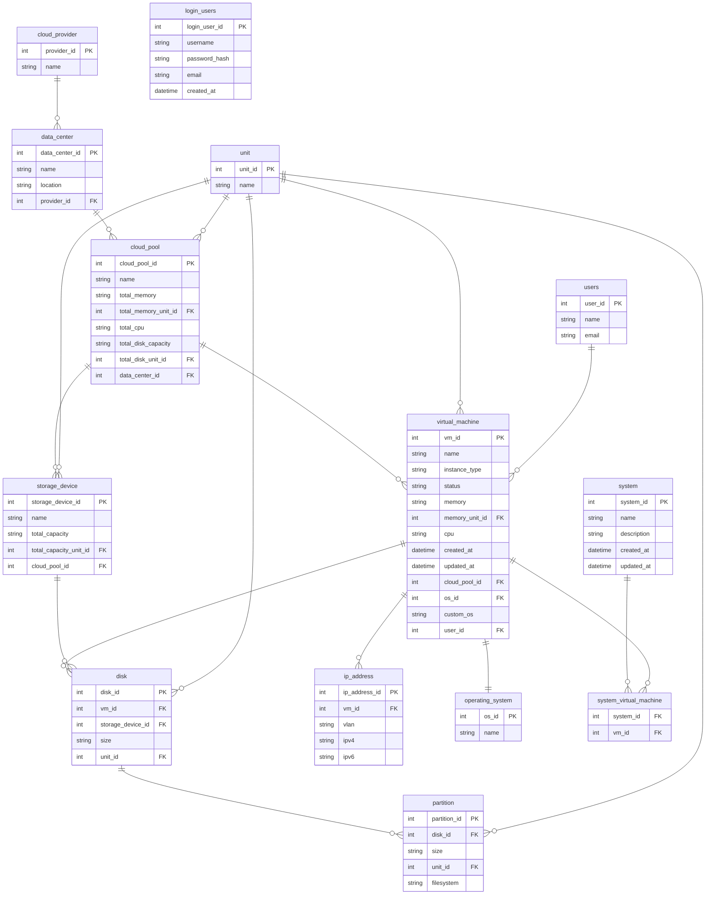

# ER 図

```mermaid
erDiagram
    cloud_provider {
        int provider_id PK
        string name
    }
    data_center {
        int data_center_id PK
        string name
        string location
        int provider_id FK
    }
    cloud_pool {
        int cloud_pool_id PK
        string name
        string total_memory
        int total_memory_unit_id FK
        string total_cpu
        string total_disk_capacity
        int total_disk_unit_id FK
        int data_center_id FK
    }
    virtual_machine {
        int vm_id PK
        string name
        string instance_type
        string status
        string memory
        int memory_unit_id FK
        string cpu
        datetime created_at
        datetime updated_at
        int cloud_pool_id FK
        int os_id FK
        string custom_os
        int user_id FK
    }
    storage_device {
        int storage_device_id PK
        string name
        string total_capacity
        int total_capacity_unit_id FK
        int cloud_pool_id FK
    }
    disk {
        int disk_id PK
        int vm_id FK
        int storage_device_id FK
        string size
        int unit_id FK
    }
    partition {
        int partition_id PK
        int disk_id FK
        string size
        int unit_id FK
        string filesystem
    }
    ip_address {
        int ip_address_id PK
        int vm_id FK
        string vlan
        string ipv4
        string ipv6
    }
    operating_system {
        int os_id PK
        string name
    }
    unit {
        int unit_id PK
        string name
    }
    system {
        int system_id PK
        string name
        string description
        datetime created_at
        datetime updated_at
    }
    system_virtual_machine {
        int system_id FK
        int vm_id FK
    }
    users {
        int user_id PK
        string name
        string email
    }
    login_users {
        int login_user_id PK
        string username
        string password_hash
        string email
        datetime created_at
    }

    cloud_provider ||--o{ data_center: ""
    data_center ||--o{ cloud_pool: ""
    cloud_pool ||--o{ virtual_machine: ""
    cloud_pool ||--o{ storage_device: ""
    virtual_machine ||--o{ disk: ""
    storage_device ||--o{ disk: ""
    disk ||--o{ partition: ""
    virtual_machine ||--o{ ip_address: ""
    virtual_machine ||--|| operating_system: ""
    unit ||--o{ cloud_pool: ""
    unit ||--o{ virtual_machine: ""
    unit ||--o{ storage_device: ""
    unit ||--o{ disk: ""
    unit ||--o{ partition: ""
    system ||--o{ system_virtual_machine: ""
    virtual_machine ||--o{ system_virtual_machine: ""
    users ||--o{ virtual_machine: ""

```
